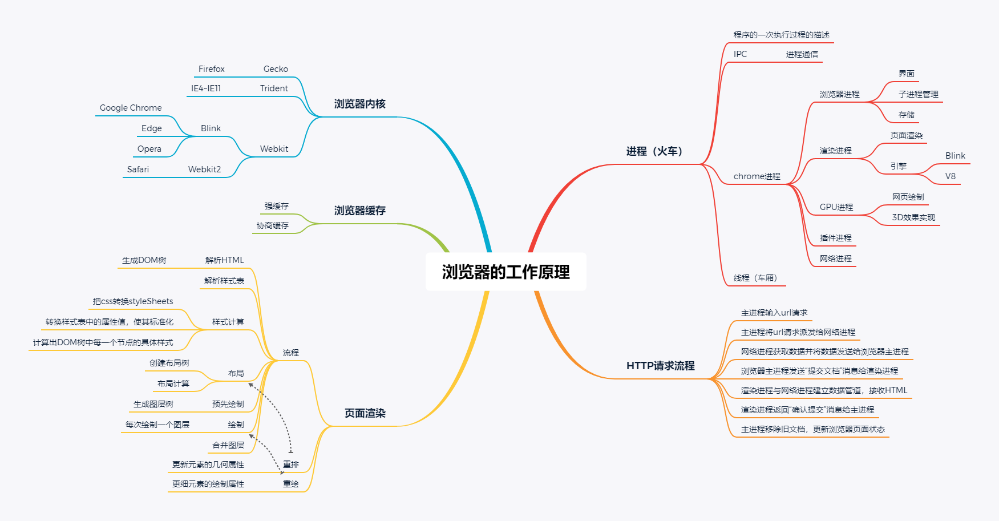
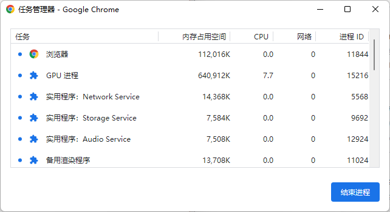
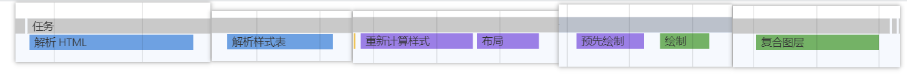
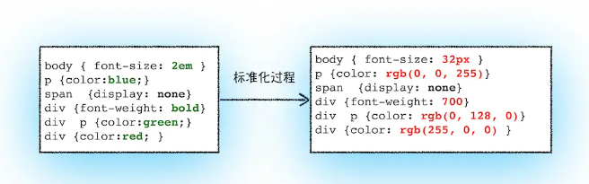
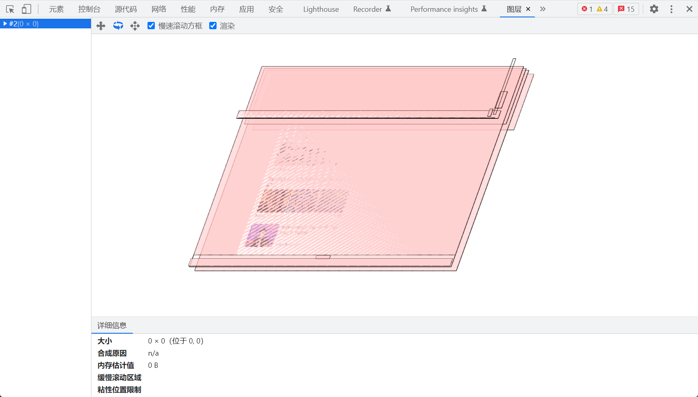
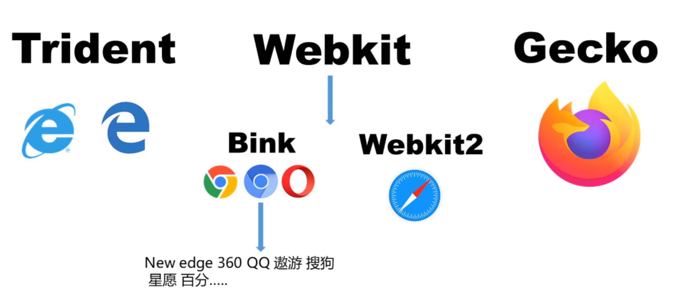

# 浏览器工作原理

### 进程和线程

#### 基本概念
进程（process）是运行中的程序的描述，是资源分配的最小单位，也是对应于某段CPU执行时间的描述。 
浏览器属于一个应用程序，而应用程序的一次执行，可以理解为计算机启动了一个进程

线程是CPU调度的最小单位，一个进程可以包含多个线程

#### IPC机制（Inter Process Communication）
启动的进程会创建另外的新的进程来处理其他任务，这些创建出来的新的进程拥有全新的独立的内存空间，不能与原来的进程内向内存，如果这些进程之间需要通信，可以通过IPC机制（Inter Process Communication）来进行

#### chrome多进程架构

在chrome的任务管理器中可以看到chrome的进程列表

一般来说，打开一个chrome页面会有5个进程，分别是：
- 浏览器进程(Browser Process)：主要负责界面显示、用户交互、子进程管理、同时提供存储等功能。
- 渲染进程 (Renderer Process)：核心任务是将HTML、CSS和JavaScript转换为用户可以与之交互的网页，排版引擎Blink和JavaScript引擎V8都运行在该进程中，默认情况下，Chrome为每一个Tab标签页创建一个渲染进程。出于安全考虑，渲染进程都是运行在沙箱模式下的。
- GPU进程 (GPU Process)：GPU图形处理器（graphics processing unit)，的使用初衷是为了实现3DCSS的效果，随后网页、Chrome的ui界面都选择采用GPU来绘制，这使得GPU成为浏览器的普遍需求。
- 插件进程 (Plugin Process)：主要负责插件的运行，通过对插件的隔离可以保证插件进程崩溃不会对浏览器和页面造成影响。
- 网络进程(Network process)：主要负责页面的网络资源加载

#### 从进程角度看页面请求流程

1.浏览器主进程输入url请求  
2.浏览器主进程将url请求派发给网络进程 
3.网络进程发送url请求，获取响应头数据，解析响应头数据，并将数据发送给浏览器主进程 
4.浏览器主进程发送“提交文档”消息给渲染进程 
5.渲染进程收到消息后与网络进程建立数据管道，接收HTML 
6.数据传输完毕，渲染进程返回“确认提交”消息给主进程 
7.主进程移除旧文档，更新浏览器页面状态

### 页面渲染流程
从chrome的性能分析可以看到页面加载的各个阶段
一个普通页面的渲染流程为：
解析HTML→解析样式表→样式计算→布局→预先绘制→绘制→合并图层

#### 1.解析HTML
因为浏览器无法直接理解和使用HTML，所以需要将HTML转化为浏览器能够理解的结构--DOM树
#### 2.解析样式表
当页面中引入外部样式时会解析样式表
#### 3.样式计算
样式计算的目的是为了计算出DOM节点中每一个元素的具体样式，这个阶段大体分三步
- 把css转换为浏览器内容理解的结构 styleSheets
- 转换样式表中的属性值，使其标准化
- 样式合并，计算出DOM树中每一个节点的具体样式

#### 4.布局
布局的意思是计算DOM树中可见元素的几何位置
布局阶段主要分为两个步骤：
- 创建布局树
- 布局计算
#### 5.预先绘制
在此阶段会生成图层树  
页面中有很多复杂的效果，如一些复杂的3D转换，页面滚动，或者使用z-index，为了更方便的实现这些效果，渲染引擎需要为特定的节点生成专门的图层，并生成一棵对应的图层树(LayerTree)  
通过chrome的图层工具可以看到当前页面的图层信息,下图为百度首页的图层展示

#### 6.绘制
在完成图层树的构建之后，渲染引擎会对图层树中的每个图层进行绘制 
绘制操作是由渲染引擎中的合成线程来完成 
当图层的绘制列表准备好之后，主线程会把该绘制列表提交给合成线程 

有时候，一个图层很大，可视窗口只占一小部分，所以没有必要要一次性绘制完图层所有的内容，因此，合成线程会将图层划分为图块(tile)，将图块转化为位图(能够看到的图层区域))称为栅格化，此过程中通常会使用GPU加速

#### 7.合并图层
一旦所有图块被栅格化(又称光栅化)，合成线程就会生成一个绘制图块的命令--“DrawQuad”,然后将该命令提交给浏览器进程。 
浏览器进程里有一个叫viz的组件，用来接收合成线程发过来的DrawQuad命令，然后根据DrawQuad命令，将其页面内容绘制到内存中，最后显示在屏幕上

### 浏览器内核

不同浏览器由不同内核组成
- Gecko:早期被Netscape和Mozilla Firefox浏览器浏览器使用; 
- Trident:微软开发，被IE4~IE11浏览器使用，但是Edge浏览器已经转向Blink ; 
- Webkit:苹果基于KHTML开发、开源的，用于Safari,Google Chrome之前也在使用; 
- Blink:是Webkit的一个分支，Google开发，目前应用于Google Chrome、Edge、Opera等;

