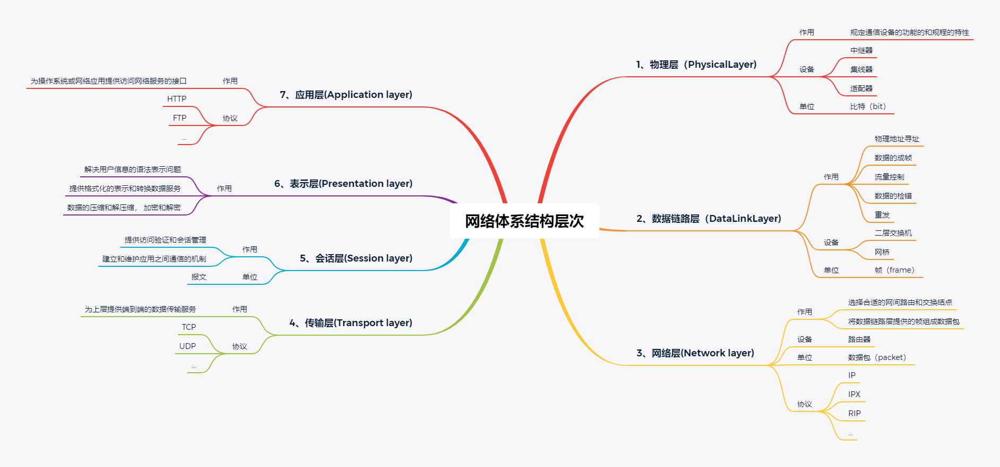
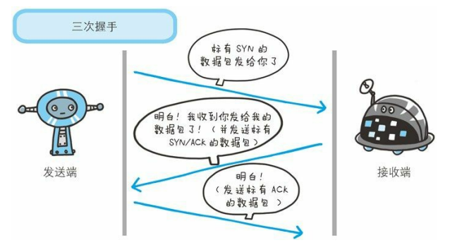
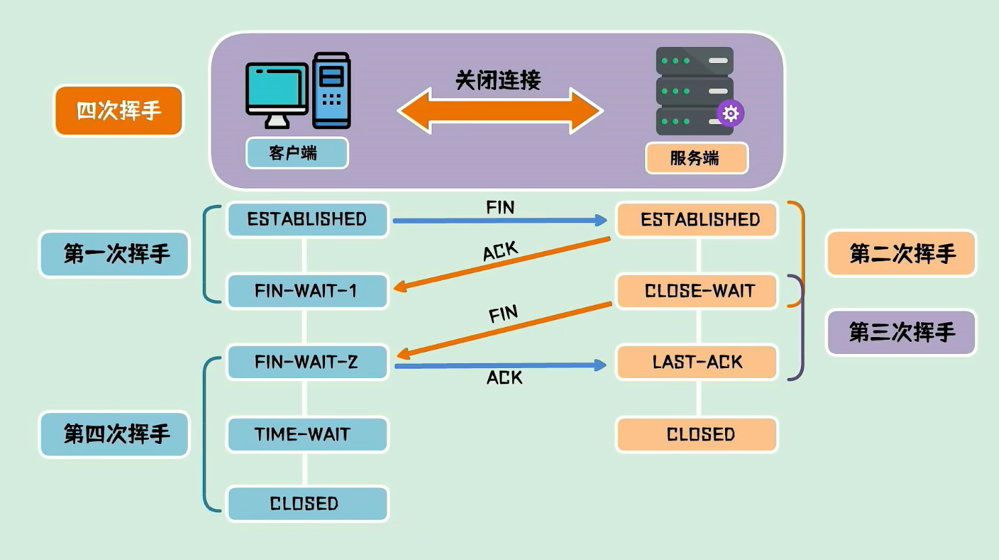

# TCP三次握手和四次挥手

### TCP协议
传输控制协议（TCP）是Internet一个重要的传输层协议。TCP提供面向连接、可靠、有序、字节流传输服务。应用程序在使用TCP之前，必须先建立TCP连接；TCP通过校验和、序列号、确认应答、重发控制、连接管理以及窗口控制等机制实现可靠性传输。

### 传输层
传输层是整个网络体系结构中的关键层次之一，主要负责向两个主机中进程之间的通信提供服务。由于一个主机同时运行多个进程，因此运输层具有复用和分用功能。传输层在终端用户之间提供透明的数据传输，向上层提供可靠的数据传输服务。传输层在给定的链路上通过流量控制、分段/重组和差错控制来保证数据传输的可靠性。传输层的一些协议是面向链接的，这就意味着传输层能保持对分段的跟踪，并且重传那些失败的分段。

### 网络体系结构
网络体系结构是指通信系统的整体设计，它为网络硬件、软件、协议、存取控制和拓扑提供标准。它广泛采用的是国际标准化组织（ISO）在1979年提出的开放系统互连（OSI-Open System Interconnection)的参考模型。

### 三次握手（three-way handshaking）

三次握手是TCP协议为了确保数据能到达目标而采用的策略

重要字段

- seq：（sequence number）序号
- ack：（acknowledgement number）确认号
- 标志位（flag）：
    - SYN ：（synchronization）同步
    - ACK ：（acknowlegment）确认
    - FIN ：（finish）终止

发送端首先发送一个带 SYN 标志的数据包给对方。 
接收端收到后，回传一个带有 SYN/ACK 标志的数据包以示传达确认信息。 
最后，发送端再回传一个带 ACK 标志的数据包，代表“握手”结束。

为了防止接受重复的数据，TCP引入了一个机制，来识别是否已经接收到了这个数据，这个就是序列号；序列号是按顺序给发送数据的每一个字节（8位字节）都标上号码的编号，接收端查询接收数据TCP首部的序列号和数据的长度，来确认自己下一步应该接收的序号最为确认应答返送回去。

### 四次挥手（Four-Way Wavehand）

所谓四次挥手（Four-Way Wavehand）即终止TCP连接，就是指断开一个TCP连接时，需要客户端和服务端相互总共发送4个包以确认连接的断开。在socket编程中，这一过程由客户端或服务端任一方执行close来触发。

客户端首先发送一个带FIN标志的数据包到服务端，然后进入终止等待1状态 
服务端收到数据后，发送ACK包到客户端，然后进入等待关闭状态，客户端收到后进入终止等待2状态，此时服务端还可发送未发送数据，客户端还可接收数据 
服务端发送完数据后发送FIN包到客户端，进入最后确认状态 
客户端收到后发送ACK包，进入超时等待状态，超时后关闭连接，服务端接收后立即关闭

文章参考

《图解HTTP》 
https://blog.csdn.net/qq_44647809/article/details/115143100  
https://baijiahao.baidu.com/s?id=1686533861418970902&wfr=spider&for=pc 
https://www.bilibili.com/video/BV1kV411j7hA?spm_id_from=333.337.search-card.all.click
