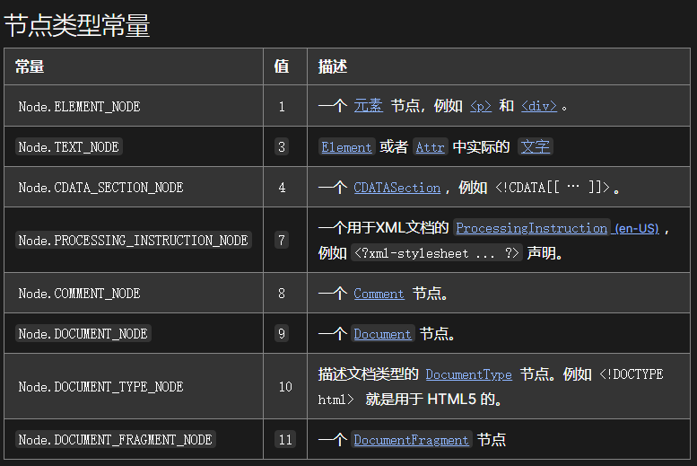

# jQuery offset

jQuery用于返回或设置匹配与元素相对于文档的偏移，返回对象包含两个整型属性：top和left

- 方法一通过递归实现

遍历父节点，累加偏移量

@[code{1-47}](./code/jq_offset.js)

- 方法二 通过getBoundingClientRect实现

getBoundingClientRect 方法用来描述一个DOM元素的具体位置，四个属性是相对于视口左上角而言的
ownerDocument是DOM节点的一个属性，返回当前节点顶层的document对象
@[code{51-76}](./code/jq_offset.js)

